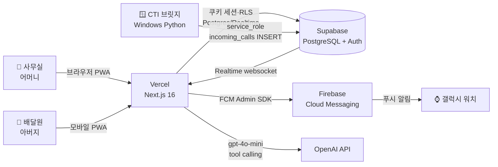
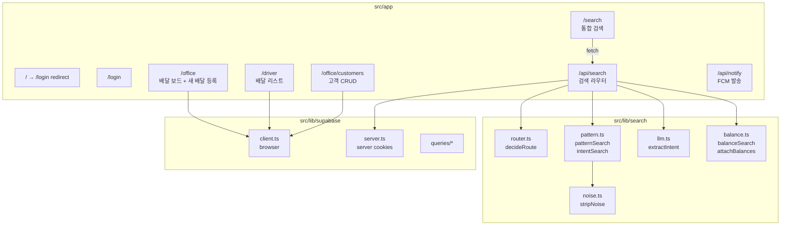
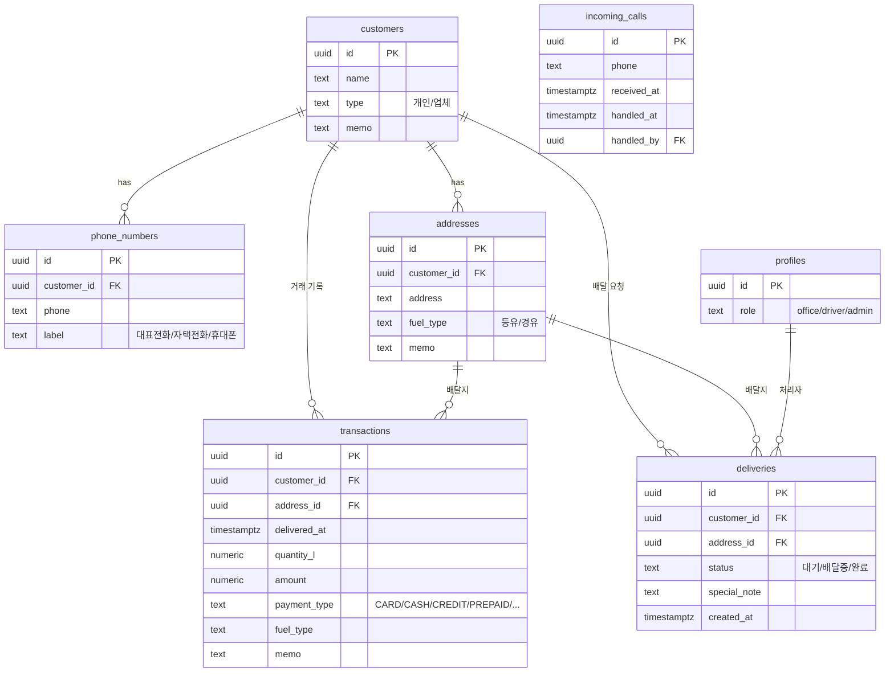
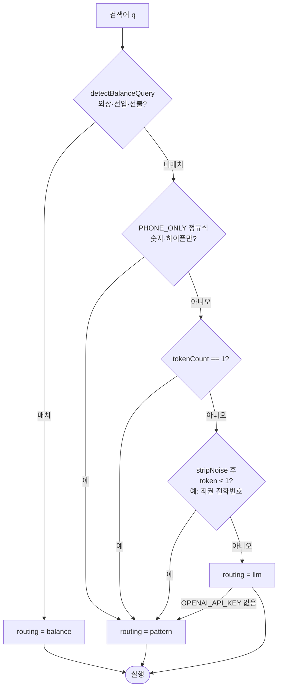
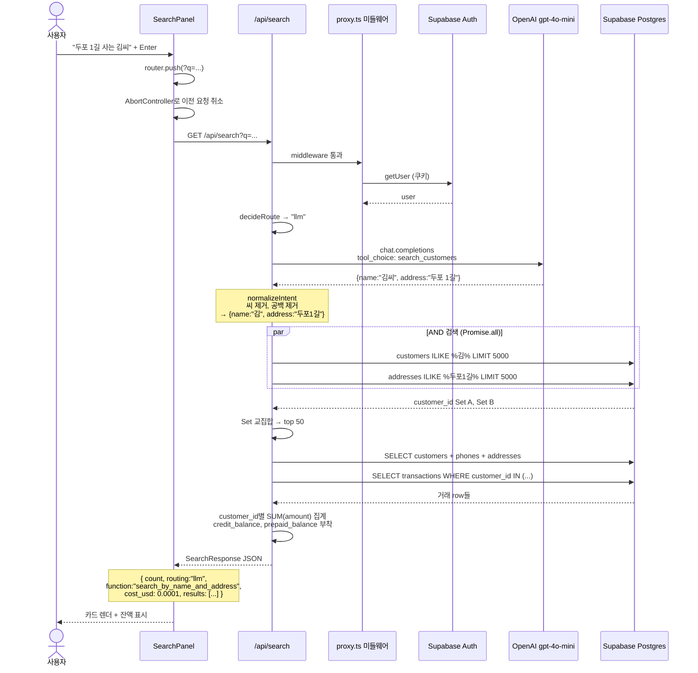
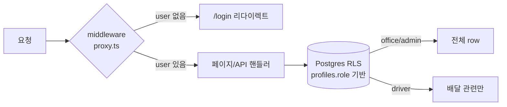

# SamSan 아키텍처

경남 고성 삼산주유소의 배달관리·고객관리·정산 자동화 PWA. 카톡+공책+엑셀 3중 수기를 한 앱으로 통합.

## 1. 시스템 컨텍스트

**역할 분담**
- **사무실**: 전화 수신 확인, 배달 지시, 고객/외상 관리, 검색
- **배달원**: 배달 목록 확인, 현장 완료 입력, 가구 정보 검색
- **CTI 브릿지**: 사무실 PC 상주, 전화 수신 → `incoming_calls` 테이블 insert만 담당
- **OpenAI**: 자연어 검색 의도 추출 (선택적, 키 없으면 graceful fallback)

## 2. 페이지 / 컴포넌트 구조

전역 미들웨어 `src/proxy.ts`가 모든 라우트 인증을 가로채서 비로그인 → `/login` 강제 리다이렉트.

## 3. 데이터 모델

**핵심 비즈니스 룰** (CLAUDE.md):
- 잔액은 transactions 합산으로 계산 (저장 안 함, single source of truth)
- 외상(CREDIT) 한도 없음 — 음수 진입 시 경고만, 막지 않음
- 선입(PREPAID) 잔액 음수 허용 — 경고만

## 4. 검색 시스템

### 4.1 라우팅 결정

### 4.2 자연어 쿼리 전체 시퀀스

### 4.3 3가지 라우팅별 동작 차이

| 라우팅 | 트리거 예시 | DB 동작 | 비용 | 지연 |
|---|---|---|---|---|
| **pattern** | `큰들`, `010-8331`, `김식백`, `최권 전화번호` | name·phone·label·address 4컬럼 OR ILIKE | $0 | ~600ms |
| **llm** | `두포 1길 사는 김씨`, `포교에 있는 외상` | LLM 의도 추출 → 추출 필드 AND ILIKE | ~$0.0001/쿼리 | ~1.5s |
| **balance** | `외상`, `선입`, `선불`, `외상 있는` | transactions SUM > 0 desc 정렬 | $0 | ~300ms |

모든 라우팅 결과는 `attachBalances`로 외상·선입 잔액 자동 부착 → 카드에 색 표시.

## 5. 인증·권한

- **인증**: Supabase Auth (이메일·비밀번호). 쿠키 세션.
- **인가**: `profiles.role`(office/driver/admin) 기반 RLS 정책으로 DB 측에서 enforce.
- **API 라우트**: 미들웨어 통과 후 라우트 핸들러에서 `auth.getUser()` 한 번 더 확인 → 없으면 401.
- **CTI 브릿지**: service_role 키로 RLS 우회 (사무실 PC 로컬에만 보관).

## 6. 외부 의존성 / 환경변수

| 변수 | 용도 | 필수 | 위치 |
|---|---|---|---|
| `NEXT_PUBLIC_SUPABASE_URL` | Supabase 프로젝트 URL | ✅ | client+server |
| `NEXT_PUBLIC_SUPABASE_ANON_KEY` | Supabase anon 키 (RLS 적용) | ✅ | client+server |
| `SUPABASE_SERVICE_ROLE_KEY` | service_role (RLS 우회, 서버 전용) | ⭕ import 시 | server only |
| `NEXT_PUBLIC_FIREBASE_*` | FCM 클라이언트 설정 | ⭕ 푸시 시 | client |
| `FIREBASE_CLIENT_EMAIL`, `FIREBASE_PRIVATE_KEY` | Firebase Admin SDK | ⭕ 푸시 시 | server only |
| `OPENAI_API_KEY` | gpt-4o-mini 호출 | ❌ 없으면 LLM→pattern fallback | server only |

## 7. 배포

- **Vercel**: main 브랜치 push → 자동 빌드 + 배포
- **Supabase**: 별도 호스팅, 마이그레이션은 Supabase Studio SQL Editor에서 수동 실행 (DDL 자동 실행 금지 정책)
- **CTI 브릿지**: 사무실 PC에 1회 설치 후 Windows 자동 시작 등록 (`cti-bridge/setup-autostart.ps1`)
